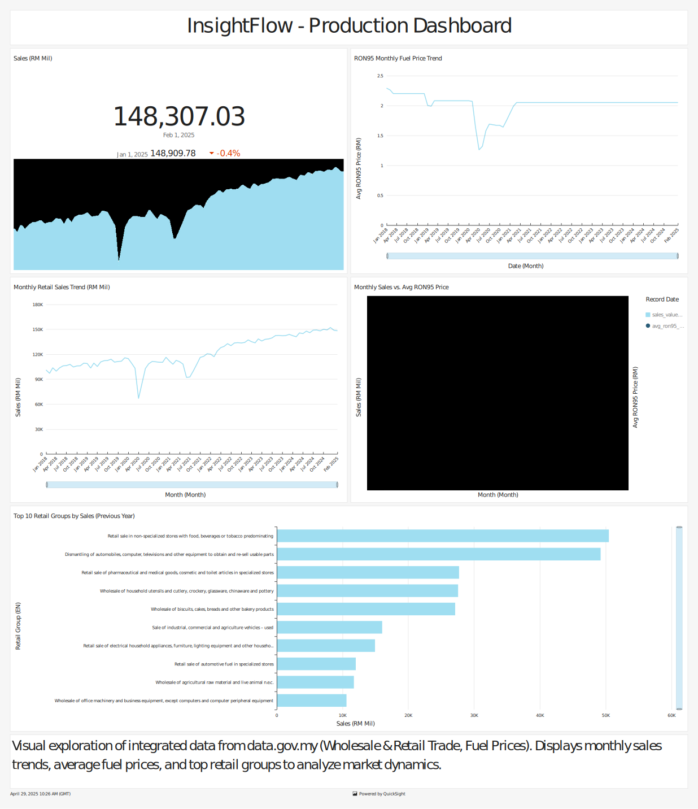

# InsightFlow – Integrated Retail and Economic Batch Data Pipeline

> **About:** A data engineering portfolio project using AWS cloud services to analyze correlations between Malaysian retail performance and fuel prices. Features Terraform IaC, ETL with AWS S3, Glue, SQL analytics via Athena coupled with data transformation via dbt, and workflow orchestration with Kestra.


## Project Status
✅ **Complete**: This project has been successfully developed and deployed. All planned features have been implemented, and the pipeline is fully operational.

### Key Features
- **Automated Data Ingestion**: Fetches retail and fuel price data from public sources using AWS Batch.
- **Data Transformation**: Cleans, normalizes, and models data using dbt, creating an analysis-ready star schema.
- **Workflow Orchestration**: Manages the end-to-end pipeline with Kestra, ensuring reliability and observability.
- **Data Visualization**: Provides interactive dashboards in Metabase (dev) and AWS QuickSight (prod) for insights into retail trends and fuel price correlations.
- **Infrastructure as Code**: Uses Terraform to provision and manage cloud resources for reproducibility and scalability.

### Future Enhancements
While the project is complete, potential future updates could include:
- Real-time data processing with AWS Kinesis or Kafka.
- Advanced analytics with machine learning models for predictive insights.
- Multi-region deployment for enhanced scalability and redundancy.

## Overview

**Project Title: InsightFlow – Integrated Retail and Economic Batch Data Pipeline**

**Overview**: Design and implement a robust batch data pipeline that ingests, processes, and analyzes sales and economic data from multiple public sources on data.gov.my. The pipeline will generate insights to inform business decisions and help correlate retail trends with economic factors such as fuel prices.

**Problem statement:**
Businesses, economists, and policymakers often need to understand the interplay between macroeconomic indicators and sector-specific performance. In Malaysia, analyzing the potential correlation between retail trade trends and fluctuating fuel prices requires integrating data from disparate public sources (Department of Statistics Malaysia, Ministry of Finance).

However, manually accessing, downloading, cleaning, aligning (e.g., weekly fuel prices vs. monthly trade data), and integrating these datasets is a time-consuming, repetitive, and error-prone process. This manual approach hinders the ability to perform timely, consistent, and scalable analysis, making it difficult to quickly identify potential trends, seasonal patterns, or correlations that could inform strategic decisions. There is a need for an automated, reliable system to handle this data integration and preparation challenge.

**Project Objective:**
The primary objective of the InsightFlow project is to **design, implement, and orchestrate an end-to-end, automated batch data pipeline on AWS**. This pipeline will demonstrate modern data engineering practices including Infrastructure as Code (IaC), containerization, workflow orchestration, data modeling with dbt, and cloud-based data warehousing & data lakes.

Specifically, the pipeline will:

1. **Ingest** weekly fuel price data and monthly wholesale & retail trade data (both headline and by 3-digit MSIC group) from public Malaysian sources (`data.gov.my` APIs and direct downloads) using scheduled AWS Batch jobs running containerized Python scripts.
2. **Store** raw ingested data reliably in an AWS S3 data lake with a logical structure.
3. **Transform and Model** the data using dbt Cloud, performing cleaning, normalization, date alignment (aggregating weekly fuel prices to monthly), and structuring the data into a clear, analysis-ready format (star schema). This includes integrating MSIC lookup data to provide meaningful descriptions for retail groups.
4. **Load** the transformed data into a partitioned data warehouse layer within AWS S3, optimized for querying via AWS Athena.
5. **Orchestrate** the entire workflow (ingestion, transformation, testing) using Kestra, ensuring reliability, error handling, and observability.
6. **Enable Analysis & Visualization** of the integrated dataset via AWS Athena, supporting the creation of dashboards (in AWS QuickSight and Metabase) to explore trends in retail sales and their correlation with fuel prices.
7. **Ensure Reproducibility** by managing cloud infrastructure using Terraform and maintaining clear documentation and version-controlled code (in Git).

## Dataset

1. [Headline Wholesale & Retail Trade](https://data.gov.my/data-catalogue/iowrt)
    <details> <summary>Data Dictionary</summary>
        
    ### **Dataset description**
    
    Overall performance of the wholesale & retail trade subsectors, covering sales value and volume.
    Renaming of column name due to SQL Reserved Keywords conflict:

    - `date` → `ymd_date`

    These column names are renamed using our ingestion script. 
    
    ### **Variable definitions**
    
    | **Name in Dataset** | **Variable** | **Definition** |
    | --- | --- | --- |
    | **series (String)** | **Series Type** | **Series type, either absolute values ('abs'), year-on-year growth ('growth_yoy') or month-on-month growth ('growth_mom')** |
    | date (Date) | Date | The date in YYYY-MM-DD format, with DD set to 01 as the data is at monthly frequency |
    | sales (Float, RM mil) | Sales Value | The total sum paid by customers, in RM millions |
    | volume (Float) | Volume Index | Quantity of items sold, expressed as an index with base 2015 = 100 |
    | volume_sa (Float) | Volume Index (sa) | Quantity of items sold, expressed as a seasonally adjusted index with base 2015 = 100 |
    
    ### **Last updated:**
    
    11 Apr 2025, 12:00
    
    ### **Next update:**
    
    13 May 2025, 12:00
    
    ### **Data source(s)**
    
    - Department of Statistics Malaysia
    
    ### **URLs to dataset**
    
    - https://storage.dosm.gov.my/iowrt/iowrt.csv
    - https://storage.dosm.gov.my/iowrt/iowrt.parquet
    
    ### **License**
    
    This data is made open under the Creative Commons Attribution 4.0 International License (CC BY 4.0). A copy of the license is available [Here.](https://creativecommons.org/licenses/by/4.0/)

    </details>
        
2. [Wholesale & Retail Trade by Group (3-digit)](https://data.gov.my/data-catalogue/iowrt_3d)
    <details> <summary>Data Dictionary</summary>
        
    ### **Dataset description**
    
    Performance of the wholesale & retail trade subsectors by MSIC group (3 digit), covering sales value and volume. The table provides a preview of the full dataset using the latest month of data only.
    Renaming of column name due to SQL Reserved Keywords conflict:

    - `date` → `ymd_date`
    - `group` → `group_code`

    These column names are renamed using our ingestion script.

    
    
    ### **Variable definitions**
    
    | **Name in Dataset** | **Variable** | **Definition** |
    | --- | --- | --- |
    | **series (String)** | **Series Type** | **Series type, either absolute values ('abs'), year-on-year growth ('growth_yoy') or month-on-month growth ('growth_mom')** |
    | date (Date) | Date | The date in YYYY-MM-DD format, with DD set to 01 as the data is at monthly frequency |
    | group (String) | Group | 3-digit code, to be matched using the 'group' column in the [MSIC Lookup](https://open.dosm.gov.my/data-catalogue/msic). The MSIC lookup table will give you the English and Malay definitions. |
    | sales (Float, RM mil) | Sales Value | The total sum paid by customers, in RM millions |
    | volume (Float) | Volume Index | Quantity of items sold, expressed as an index with base 2015 = 100 |
    
    ### **Last updated:**
    
    11 Apr 2025, 12:00
    
    ### **Next update:**
    
    13 May 2025, 12:00
    
    ### **Data source(s)**
    
    - Department of Statistics Malaysia
    
    ### **URLs to dataset**
    
    - https://storage.dosm.gov.my/iowrt/iowrt_3d.csv
    - https://storage.dosm.gov.my/iowrt/iowrt_3d.parquet
    
    ### **License**
    
    This data is made open under the Creative Commons Attribution 4.0 International License (CC BY 4.0). A copy of the license is available [Here.](https://creativecommons.org/licenses/by/4.0/)

    </details>
        
3. [Price of Petroleum & Diesel](https://data.gov.my/data-catalogue/fuelprice)
    <details> <summary>Data Dictionary</summary>
    
    ### **Dataset description**
    
    Weekly retail prices of RON95 petrol, RON97 petrol, and diesel in Malaysia. Renaming of column name due to SQL Reserved Keywords conflict:

   - `date` → `ymd_date`

    These column names are renamed using our ingestion script.
    
    ### **Variable definitions**
    
    | **Name in Dataset** | **Variable** | **Definition** |
    | --- | --- | --- |
    | **series_type (categorical)** | **Chart Type** | **Price in RM (level), or weekly change in RM (change_weekly).** |
    | date (Date) | Date | The date of effect of the price, in YYYY-MM-DD format |
    | ron95 (Float) | RON95 Petrol Price | Price per litre of RON95 petrol, in RM |
    | ron97 (Float) | RON97 Petrol Price | Price per litre of RON97 petrol, in RM |
    | diesel (Float) | Price of Diesel (Peninsular Malaysia) | Price per litre of diesel in Peninsular Malaysia, in RM |
    | diesel_eastmsia (Float) | Price of Diesel (East Malaysia) | Price per litre of diesel in East Malaysia, in RM |
    
    ### **Last updated:**
    
    16 Apr 2025, 23:59
    
    ### **Next update:**
    
    23 Apr 2025, 23:59
    
    ### **Data source(s)**
    
    - Ministry of Finance
    
    ### **URLs to dataset**
    
    - https://storage.data.gov.my/commodities/fuelprice.csv
    - https://storage.data.gov.my/commodities/fuelprice.parquet
    
    ### **License**
    
    This data is made open under the Creative Commons Attribution 4.0 International License (CC BY 4.0). A copy of the license is available [Here.](https://creativecommons.org/licenses/by/4.0/)

    </details>
        
4. [MSIC Lookup](https://open.dosm.gov.my/data-catalogue/msic)
    <details> <summary>Data Dictionary</summary>

    >[!NOTE]
    >The column name `group` in the `msic_lookup.csv` file conflicts with the reserved SQL keyword `GROUP` in Athena. When referenced in SQL without proper escaping, Athena interprets it as the keyword instead of a column name. Unfortunately, escaping using `“”` isn’t working either. The best solution is to change the column name `group` in `misc_lookup.csv` to `group_code`.
        
    ### **Dataset description**
    
    This table provides a complete lookup for the MSIC (Malaysian Standard Industrial Classification) 2008, as applied and used in data publications in Malaysia. The MSIC is primarily used by the Department of Statistics Malaysia (DOSM), for the purpose of categorising economic data, such as during the production of GDP data.
    
    ### **Variable definitions**
    
    | **Name in Dataset** | **Variable** | **Definition** |
    | --- | --- | --- |
    | **digits (Integer)** | **Digits** | **Number of digits; this column can be used as a filter if you only want to keep 2 digit codes, for example** |
    | section (String) | Section | 1-digit code; unlike the 2 to 5-digit codes, this is a letter rather than than a number |
    | division (String) | Division | 2-digit code; please ensure that you read this column as a string, because the (intentional) leading zeroes will be dropped if read as an integer (e.g. upon opening in Microsoft Excel) |
    | group (String) | Group | 3-digit code, with dashes where not applicable (e.g. for rows providing 2-digit definitions) |
    | class (String) | Class | 4-digit code, with dashes where not applicable (e.g. for rows providing 2 and 3-digit definitions) |
    | item (String) | Item | 5-digit code, with dashes where not applicable (e.g. for rows providing 2, 3, and 4-digit definitions) |
    | desc_en (String) | Description (EN) | Description for the code, in English |
    | exclude_en (String) | Exclusions (EN) | List of inclusions, in English, provided for avoidance of doubt |
    | include_en (String) | Inclusions (EN) | List of exclusions, in English, provided for avoidance of doubt |
    | desc_bm (String) | Description (BM) | Description for the code, in Malay |
    | exclude_bm (String) | Exclusions (BM) | List of inclusions, in Malay, provided for avoidance of doubt |
    | include_bm (String) | Inclusions (BM) | List of exclusions, in Malay, provided for avoidance of doubt |
    
    ### **Last updated:**
    
    31 Dec 2008, 23:59
    
    ### **Next update:**
    
    N/A
    
    ### **Data source(s)**
    
    - Department of Statistics Malaysia
    
    ### **URLs to dataset**
    
    - https://storage.dosm.gov.my/dictionaries/msic.csv
    - https://storage.dosm.gov.my/dictionaries/msic.parquet
    
    ### **License**
    
    This data is made open under the Creative Commons Attribution 4.0 International License (CC BY 4.0). A copy of the license is available [Here.](https://creativecommons.org/licenses/by/4.0/)

    </details>

## Data Modeling Approach (using dbt Cloud & Athena)

The project utilizes dbt to transform raw data into an analytical star schema stored in the processed S3 bucket and queryable via Athena.

- **Staging Layer** (`insightflow_[dev|prod]_staging schema`): Basic cleaning, renaming, type casting of raw source data. Materialized as views.

- **Intermediate Layer**: Contains models for necessary pre-computation (e.g., `int_fuelprice_monthly` for aggregating weekly fuel prices). Materialized as views.

- **Mart Layer** (`insightflow_[dev|prod]_marts schema`): Final analysis-ready tables.

- **dim_date**: Date dimension generated using dbt_utils.

- **dim_msic_group**: Retail group dimension sourced from the MSIC seed file.

- **fct_retail_sales_monthly**: Monthly fact table joining trade data with fuel prices and dimension keys. Materialized as a table, partitioned by year and month in S3 for efficient Athena querying.

This modeling approach provides a clear, maintainable structure using dbt best practices and optimizes the data layout in S3 for efficient querying with Athena.

The Entity Relational Diagram (ERD) for the final Data Warehouse is illustrated as follows:

<center>

-InsightFlow.svg)

</center>

## Tech Stacks and Architecture

- **Data Pipeline:** Batch
- **Cloud**: AWS
    
    **Description**: AWS provides a secure, scalable, and flexible suite of cloud computing services, including storage, compute, databases, and machine learning, to host and manage applications efficiently.

- **Container Registry**: AWS ECR

    **Description**: AWS Elastic Container Registry (ECR) is a fully managed container registry that makes it easy to store, manage, and deploy Docker container images. It integrates seamlessly with AWS services, ensuring secure, scalable, and high-performance container image storage for modern application development.
    
- **Infrastructure as code (IaC)**: Terraform
    
    **Description**: Terraform is an open-source IaC tool that enables the configuration, provision, and management of infrastructure resources using declarative code, ensuring consistency and reproducibility across environments.
    
- **Workflow**: dev-to-production workflow
    
    **Description**: A structured workflow that allows seamless transitions from development to production environments, ensuring code quality, testing, and deployment processes are streamlined and automated. 
    **Summary of Dev-to-Prod Workflow:**
    
    1. **Terraform Workspaces:** Isolate infrastructure between dev and prod.
    2. **Kestra Namespaces:** Separate workflows for dev and prod environments.
    3. **Git Branching:** Use `develop` for dev and `main` for prod to manage Terraform code and dbt models.
- **Workflow orchestration**: Kestra
    
    **Description**: Kestra is a modern workflow orchestration platform that simplifies the management of complex workflows by enabling task coordination, dependency tracking, and monitoring for large-scale data pipelines.
    
- **Containerization services**: Docker
    
    **Description**: Docker is a containerization platform that simplifies application development and deployment by packaging code and dependencies into portable containers, ensuring consistency across environments.
    
- **Datalake**: S3, Postgres (dev)
    
    **Description**: Amazon S3 serves as a scalable and durable storage for raw and processed data, while Postgres is used in development to provide structured data storage and querying capabilities.

    <details>
    <summary>S3 Bucket Provisioning and Usage</summary>
    
    This project uses three distinct S3 buckets, each serving a specific purpose in the data pipeline. Below is a clarification of their roles:
    
    1. **`insightflow-terraform-state-bucket`:**
        - **Purpose:** Stores Terraform's **state files** (`.tfstate`).
        - **Details:** This bucket is crucial for Terraform itself. It's where Terraform records the state of the infrastructure it manages (which AWS resources exist, their IDs, attributes, dependencies, etc.). By using this S3 bucket as a remote backend (configured in your `main.tf` files), you ensure that the state is stored centrally and consistently, especially important if you were working in a team or running Terraform from different places. You created this bucket manually (as we decided) specifically for this purpose. Your actual project data *does not* go in here.
    
    2. **`insightflow-dev-raw-data`:**
        - **Purpose:** Acts as the **landing zone / raw layer** of your data lake for the `dev` environment.
        - **Details:** This bucket is created and managed by your `terraform/dev/01_storage` configuration. Your Python ingestion script (running via AWS Batch) is designed to fetch data from the sources (`data.gov.my`), potentially convert it to Parquet, and upload it here. The data should be organized with prefixes and partitions (e.g., `raw/iowrt/year=YYYY/month=MM/`, `raw/fuelprice/year=YYYY/month=MM/day=DD/`). The Glue Crawler scans this bucket to create table definitions.
    
    3. **`insightflow-dev-processed-data`:**
        - **Purpose:** Stores **transformed, modeled, and cleaned data** ready for analytics; also serves as a **staging area for Athena/dbt and Kestra storage** in the `dev` environment.
        - **Details:** This bucket is also created and managed by your `terraform/dev/01_storage` configuration.
            - **dbt Output:** When dbt runs and materializes models as tables (like your `fct_retail_sales_monthly`), the resulting Parquet files will be written to this bucket (likely under a specific prefix like `marts/`).
            - **Athena/dbt Staging:** Your `profiles.yml` configures dbt to use a path within this bucket (`s3://insightflow-dev-processed-data/dbt-athena-results/`) for Athena to store temporary query results.
            - **Kestra Internal Storage:** The `docker-compose.yml` file generated by Terraform's `user_data` configures Kestra itself to use this bucket for its internal storage needs (like storing flow execution logs, inputs/outputs between tasks, etc.).
    
    ### Summary:
    - **`insightflow-terraform-state-bucket`:** Terraform's own bookkeeping.
    - **`insightflow-dev-raw-data`:** Initial raw data dump.
    - **`insightflow-dev-processed-data`:** Final cleaned/modeled data and operational staging.
    
    When you eventually set up the `prod` environment, Terraform will create `insightflow-prod-raw-data` and `insightflow-prod-processed-data` buckets.

    </details>
    
    
- **Data Warehouse**: Athena, Glue, S3, Postgres (dev)
    
    **Description**: AWS Athena enables serverless querying of data directly from S3. AWS Glue provides ETL capabilities for data preparation, while Postgres supports development environments.
    
- **Data Transformation**: dbt Cloud
    
    **Description**: dbt Cloud is a SaaS-based transformation tool that enables analysts to build and manage transformations in SQL, ensuring data models are version-controlled, tested, and documented.
    
- **Tests & Docs**: dbt Cloud
    
    **Description**: dbt Cloud also supports automated testing and documentation for data pipelines, ensuring data reliability and transparency across teams.
    
- **Batch processing**: AWS Batch
    
    **Description**: AWS Batch is a managed service for efficiently running batch jobs at scale. It dynamically provisions compute resources, supports job dependencies, prioritization, and cost-efficient Spot Instances, enabling seamless execution of complex workflows without managing infrastructure.
    
- **Analytics**: Python, SQL
    
    **Description**: Python and SQL are essential tools for data analytics, enabling data manipulation, statistical analysis, and querying across structured and unstructured datasets to gain actionable insights.
    
- **Data visualization**: AWS QuickSight, Metabase (dev, interactive dashboards similar to QuickSight)
    
    **Description**: AWS QuickSight and Metabase provide powerful data visualization capabilities, enabling interactive dashboards and visual analytics for better decision-making and performance monitoring.
    
    
    
    [InsightFlow Architecture](https://app.eraser.io/workspace/zabDT6mdR2frB0ztWeJa?origin=share&elements=5OliuARf9Ow-hzhf7iSKEQ)

## InsightFlow Dashboard (Production)

The dashboard provides insights into retail sales trends and their correlation with fuel prices.

Purpose: Provides a polished, production-ready dashboard for end-users or stakeholders to consume key insights and monitor trends.

Key Features: Presents curated KPIs (e.g., recent sales figures), core trend charts (sales, fuel prices), comparisons (sales vs. fuel), and potentially allows filtering by date range or retail group. Designed for clear communication of findings.

Below is a preview of the production dashboard:



The dashboard is hosted on AWS QuickSight and can be accessed via the following URL: [InsightFlow Production Dashboard](https://ap-southeast-2.quicksight.aws.amazon.com/sn/accounts/864899839546/dashboards/0b02ec61-fa49-444f-8355-ec38a3849e28?directory_alias=pizofreude)

## Getting Started

### Prerequisites

To set up and run the project, ensure you have the following tools and configurations in place:

1. **AWS Account**
   - An AWS account is required to deploy the infrastructure and run the data pipeline.
   - **Cost-Saving Tip:** If you want to avoid using AWS Secrets Manager, you can rely on a preconfigured AWS account in your local environment (i.e., ensure `~/.aws/credentials` and `~/.aws/config` are properly set up). Refer to [this AWS documentation](https://docs.aws.amazon.com/cli/latest/userguide/cli-configure-files.html) for detailed steps on configuring your local environment.

2. **AWS CLI**
   - Install and configure the AWS CLI to interact with AWS services. Follow [this guide](https://docs.aws.amazon.com/cli/latest/userguide/install-cliv2.html) to install the AWS CLI.

3. **Terraform**
   - Install Terraform to provision the required infrastructure. Visit the [Terraform installation guide](https://developer.hashicorp.com/terraform/tutorials/aws-get-started/install-cli) for instructions.

4. **Docker**
   - Install Docker to containerize and run various components of the pipeline. See the [Docker installation guide](https://docs.docker.com/get-docker/) for platform-specific steps.

5. **Kestra**
   - Install Kestra for workflow orchestration. You can find installation instructions in the [Kestra documentation](https://kestra.io/docs/).

6. **dbt**
   - Install dbt for data transformations and modeling. Refer to the [dbt installation guide](https://docs.getdbt.com/docs/introduction/installation) for details.

---

Each prerequisite ensures that you have the necessary tools and configurations to successfully deploy and run the project. Make sure to verify each step before proceeding.

### Installation Steps

1. **Clone the Repository**
   
   ```bash
   git clone https://github.com/pizofreude/insightflow-retail-economic-pipeline.git
   cd insightflow-retail-economic-pipeline
   ```

2. **AWS Backend Setup (Manual One-Off)**
    
    Before running Terraform, manually create the resources needed for the S3 remote state backend:

    S3 Bucket: Create a globally unique S3 bucket in your target AWS region (e.g., ap-southeast-2) to store Terraform state files. Enable versioning. Keep it private. Example name: `insightflow-terraform-state-bucket-xyz`.

    DynamoDB Table: Create a DynamoDB table in the same region for state locking. Use LockID (String) as the Partition Key. Example name: `terraform-state-lock-dynamo`.

    Update Terraform Backend Config: Replace placeholder bucket/table names in the backend "s3" {} blocks within `terraform/dev/01_storage/main.tf` and `terraform/dev/02_compute/main.tf` (and eventually `prod/`) with your actual created names.

3. **Local Setup**
    
    Clone Repository:

    ```bash
    git clone [https://github.com/pizofreude/insightflow-retail-economic-pipeline.git](https://github.com/pizofreude/insightflow-retail-economic-pipeline.git)
    cd insightflow-retail-economic-pipeline
    ```

    Create & Activate Virtual Environment:

    ```bash
    python -m venv venv
    source venv/bin/activate # Linux/macOS/Git Bash
    # venv\Scripts\activate # Windows CMD/PowerShell
    ```

    Install Python Dependencies:

    ```bash
    pip install -r src/ingestion/requirements.txt # For ingestion script
    pip install -r dbt/requirements.txt          # For local dbt CLI usage
    ```

    dbt Profile Setup: Configure your local dbt connection profile at `~/.dbt/profiles.yml`. Ensure it includes targets for dev (connecting to Athena `insightflow_dev` schema) and potentially `prod`. See [`dbt/profiles.yml.example`](https://docs.getdbt.com/docs/core/connect-data-platform/profiles.yml) (you might want to create this example file) for the required structure. Do not commit your actual `profiles.yml` to Git.

    EC2 Key Pair: Create an EC2 Key Pair (e.g., kestra-server-key) in your AWS region (ap-southeast-2). Download the `.pem` file and place it securely (e.g., in the `credentials/` directory - ensure this path is in `.gitignore`). Update permissions (`chmod 400 path/to/key.pem`).

4.  **Cloud Infrastructure Setup (Terraform)**
    
    Deploy the infrastructure for the desired environment (`dev` or `prod`).

    Deploy `dev` Environment:

    Storage Layer:

    ```bash
    cd terraform/dev/01_storage
    terraform init
    terraform workspace select dev || terraform workspace new dev
    terraform apply -var-file=dev.tfvars
    ```

    Compute Layer:
    
    Create terraform/dev/02_compute/dev.tfvars and set required variables (like `batch_container_image` - see next step, `kestra_key_name`, restricted CIDR blocks).

    ```bash
    cd ../02_compute
    terraform init
    terraform workspace select dev || terraform workspace new dev
    terraform apply -var-file=dev.tfvars
    ```

    (Repeat similar steps for the prod environment using `terraform/prod/` directories and `prod.tfvars` files).

5. **Setup AWS Batch Requirement for ECR**

    To use AWS Batch for data ingestion, you need to build a Docker image from the `src/ingestion/Dockerfile` and push it to Amazon Elastic Container Registry (ECR). This image will be used by AWS Batch jobs to execute the ingestion process.

    For detailed step-by-step instructions, refer to the [Ingestion README](src/ingestion/README.md).

6. **Set Up Kestra**
   - Terraform automatically deploys a self-hosted Kestra instance on EC2 using Docker Compose.
   - Access the UI using the kestra_ui_url output from the 02_compute Terraform apply.
   - Deploy the flow definition (kestra/flows/insightflow_dev_pipeline.yml or a production equivalent) via the Kestra UI ("Flows" -> "Create"). Ensure resource names and Git branch are correct for the target environment.

7. **Run the Pipeline**
   - Trigger the Kestra workflow to start the ingestion, transformation, and testing processes.
   - Running the Pipeline
   - Navigate to Kestra UI: Open the URL for your target environment (`dev` or `prod`).
   - Go to Flows: Find the appropriate pipeline flow (e.g., `dev.pipelines.insightflow_dev_pipeline`).
   - Execute Flow: Click the "Execute" button (▶️).
   - Monitor: Go to the "Executions" tab and monitor the progress of the tasks:
     - `submit_batch_ingestion_job_cli`: Submits the ingestion job to AWS Batch. Check CloudWatch Logs for the Batch job if issues occur.
     - `start_glue_crawler_cli`: Starts the Glue Crawler. Check AWS Glue console for crawler status/logs.
     - `wait_for_crawler_and_batch`: Pauses briefly.
     - `git_clone_dbt_project`: Clones the dbt project from GitHub.
     - `dbt_deps`: Installs dbt packages.
     - `dbt_seed`: Loads seed data (MSIC lookup).
     - `dbt_run`: Executes dbt models, creating tables/views in Athena (insightflow_dev or insightflow_prod schema).
     - `dbt_test`: Runs data quality tests defined in dbt.
   - Check Kestra task logs for any errors during execution.
  
## Contributions and Feedback

We value your input and appreciate any contributions you can make to this project. If you've built a project based on this repository or have suggestions for improvement, please don't hesitate to reach out through an Issue or a Pull Request. Your feedback and suggestions are essential to helping us improve this project and make it more useful for the lifelong learner community.

## License

This project is licensed under the Apache 2.0 License. See the [LICENSE](LICENSE) file for details.